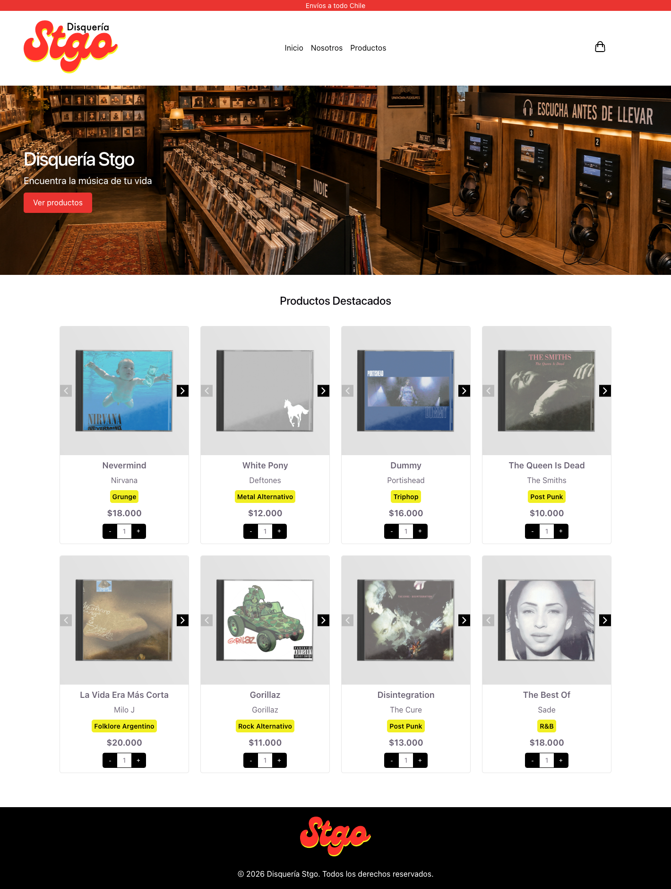
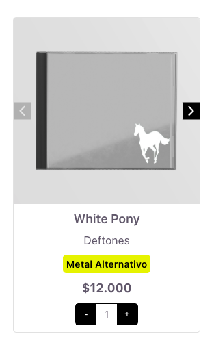

# Disquería Stgo

E-commerce de discos desarrollado en React + TypeScript como parte del Diplomado. Es una tienda online de CDs (grunge, post punk, trip hop, R&B, entre otros) que permite explorar el catálogo, ver la portada y contraportada de cada álbum y elegir la cantidad a comprar.

En esta primera entrega no hay backend: los productos se simulan con un archivo local (`src/data/products.ts`).

## Capturas de pantalla

### Vista general



### Búsqueda y tarjetas de producto



## Componentes

Todos los componentes viven en `src/components/`, cada uno en su propia carpeta con su `.tsx` y su `.css`.

| Componente | Descripción |
|---|---|
| `Header` | Barra superior con aviso de envíos, logo de la tienda, navegación por anclas e ícono de carrito. |
| `Hero` | Banner principal con título, subtítulo, imagen de fondo y botón de llamada a la acción. Recibe todo por props. |
| `Button` | Botón reutilizable con variantes `primary` y `secondary`. Recibe texto, URL, color y target por props. |
| `SearchBar` | Input controlado para buscar productos por nombre o artista. Su valor vive en el estado de `App`. |
| `ProductList` | Recibe un arreglo de productos y renderiza un `ProductCard` por cada uno usando `map` y `key`. |
| `ProductCard` | Muestra nombre, artista, categoría, precio en CLP e imágenes del producto. Maneja estado con `useState` para el carrusel de imágenes (portada/contraportada) y el selector de cantidad. |
| `Footer` | Logo y texto de derechos reservados. |

### Manejo de estado

- `App`: guarda el texto de búsqueda (`useState`) y filtra los productos antes de pasarlos a `ProductList`.
- `ProductCard`: guarda el índice de la imagen visible y la cantidad seleccionada (`useState`).

## Datos simulados

`src/data/products.ts` exporta la interfaz `Product` y un arreglo de 8 discos. Cada producto tiene:

```ts
{
  id: number
  name: string
  artist: string
  category: string
  price: number
  images: string[]   // portada y contraportada
}
```

## Cómo ejecutar el proyecto

Requisitos: Node.js 18 o superior.

```bash
# 1. Clonar el repositorio
git clone https://github.com/javierfigueroaaaby/disqueria-stgo.git
cd disqueria-stgo

# 2. Instalar dependencias
npm install

# 3. Levantar el servidor de desarrollo
npm run dev
```

Luego abrir `http://localhost:5173` en el navegador.

Otros comandos disponibles:

```bash
npm run build     # compila TypeScript y genera la versión de producción en /dist
npm run preview   # sirve la versión de producción localmente
npm run lint      # ejecuta ESLint
```

## Tecnologías usadas

- [React 19](https://react.dev/)
- [TypeScript](https://www.typescriptlang.org/)
- [Vite](https://vite.dev/)
- CSS puro (un archivo por componente + estilos globales en `index.css`)
- ESLint

## Estructura del proyecto

```
src/
├── assets/
│   └── img/            # portadas, contraportadas, logo, hero
├── components/
│   ├── Button/
│   ├── Footer/
│   ├── Header/
│   ├── Hero/
│   ├── ProductCard/
│   ├── ProductList/
│   └── SearchBar/
├── data/
│   └── products.ts     # datos simulados
├── App.tsx
├── App.css
├── index.css
└── main.tsx
```

## Flujo de trabajo con Git

El desarrollo se hizo de forma progresiva usando ramas por funcionalidad, integradas a `main` mediante Pull Requests.

## Autor

Javier Figueroa — Diplomado, 2026
