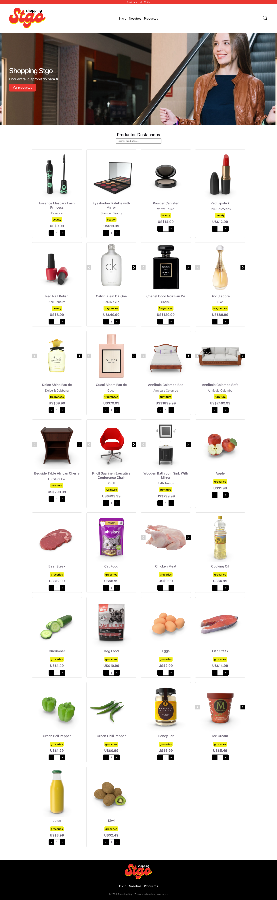
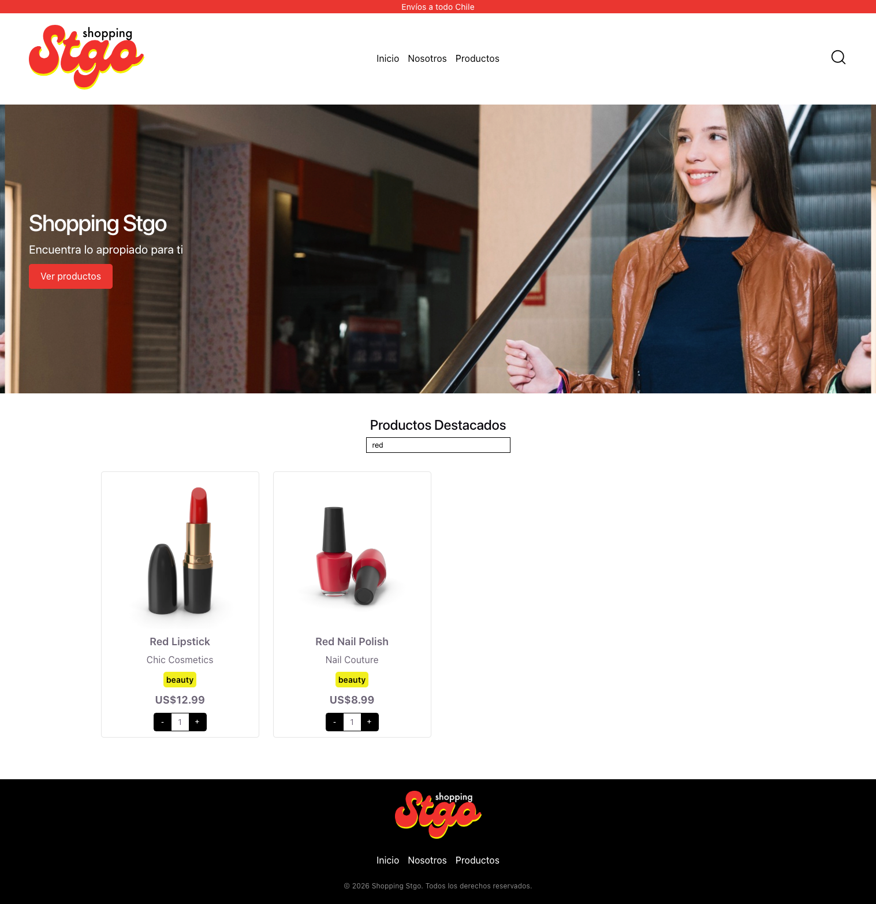

# Shopping Stgo

## Descripción

Shopping Stgo es un e-commerce desarrollado en React + TypeScript que consume la API pública [DummyJSON](https://dummyjson.com/docs/products). El catálogo se carga dinámicamente desde `https://dummyjson.com/products` y muestra productos de belleza, fragancias, muebles y supermercado.

Cada tarjeta muestra el nombre, la marca, la categoría, el precio en dólares y un carrusel con las imágenes del producto. También tiene un selector de cantidad. Sobre el listado hay un buscador en vivo que filtra los productos por nombre mientras se escribe.

### Segunda entrega: cambios respecto a la primera

En la primera entrega el proyecto era **Disquería Stgo** y los productos (8 CDs) venían de un archivo local. En esta segunda entrega:

- **Consumo de API**: los productos se obtienen con `fetch` dentro de `useEffect`, con estados de carga (`loading`), error (`error`) y datos (`products`).
- **Buscador en vivo**: nuevo componente `SearchBar`, un input controlado que filtra los productos por nombre.
- **Estados de carga y error**: nuevos componentes `Loader` y `ErrorMessage`.
- **Cambio de branding**: como DummyJSON entrega productos de distintos rubros y no discos, la tienda pasó de disquería a shopping, con nuevo logo, imagen del hero y textos.
- **Tipado**: el tipo `Product` se movió a `src/types/product.ts` y se adaptó a la estructura de DummyJSON.
- **Header y Footer**: menú de navegación con anclas a cada sección, menú móvil desplegable e ícono de búsqueda que lleva al buscador.

## Componentes creados

Cada componente está en su propia carpeta dentro de `src/components/`, con su archivo `.tsx` y su `.css`.

| Componente | Descripción |
|---|---|
| **Header** | Barra de aviso de envíos, logo de la tienda, menú de navegación, ícono de búsqueda y menú hamburguesa para mobile (maneja su apertura con `useState`). |
| **MainMenu** | Lista de enlaces de navegación. Se reutiliza en el Header (desktop y mobile) y en el Footer. |
| **Hero** | Banner principal con título, subtítulo, imagen de fondo y botón. Recibe todo su contenido por props. |
| **Button** | Botón reutilizable con variantes `primary` y `secondary`. Recibe texto, URL, color y target por props. |
| **SearchBar** | Input controlado para la búsqueda. Recibe `value`, `onChange` y `placeholder` por props; el estado vive en `App`. |
| **ProductList** | Obtiene los productos desde la API, maneja los estados de carga, error y datos, filtra según el texto de búsqueda y renderiza un `ProductCard` por producto. |
| **ProductCard** | Muestra un producto recibido por props. Usa `useState` para el carrusel de imágenes y el selector de cantidad. |
| **Loader** | Indicador visual de carga (spinner animado y texto) mientras se obtienen los productos. |
| **ErrorMessage** | Mensaje que se muestra si la API falla, con botón para reintentar. |
| **Footer** | Logo, menú de navegación y texto de derechos reservados. |

## Consumo de la API

La lógica está en `ProductList.tsx`:

```tsx
const [products, setProducts] = useState<Product[]>([])
const [loading, setLoading] = useState(true)
const [error, setError] = useState<string | null>(null)

useEffect(() => {
  const fetchProducts = async () => {
    try {
      const response = await fetch('https://dummyjson.com/products')
      if (!response.ok) throw new Error('Falló al obtener los productos')
      const data = await response.json()
      setProducts(data.products)
    } catch (err) {
      setError(err instanceof Error ? err.message : 'Error desconocido')
    } finally {
      setLoading(false)
    }
  }
  fetchProducts()
}, [])
```

Según el estado se muestra `Loader`, `ErrorMessage`, un aviso de "No se encontraron productos" o la grilla de productos.

## Búsqueda

El texto de búsqueda se guarda en un estado de `App` y se comparte con dos componentes:

- `SearchBar` lo muestra y lo actualiza al escribir.
- `ProductList` lo recibe por props y filtra los productos ya cargados, sin volver a llamar a la API:

```tsx
const filteredProducts = products.filter((product) =>
  product.title.toLowerCase().includes(search.toLowerCase())
)
```

## Instrucciones para ejecutar el proyecto

Requisitos: Node.js 20.19 o superior.

```bash
# 1. Clonar el repositorio
git clone https://github.com/javierfigueroaaaby/disqueria-stgo.git
cd disqueria-stgo

# 2. Instalar dependencias
npm install

# 3. Levantar el servidor de desarrollo
npm run dev
```

Luego abrir `http://localhost:5173` en el navegador.

Otros comandos:

```bash
npm run build     # compila TypeScript y genera la versión de producción en /dist
npm run preview   # sirve la versión de producción localmente
npm run lint      # ejecuta ESLint
```

## Tecnologías usadas

- React 19 (`useState`, `useEffect`)
- TypeScript
- Vite
- Fetch API
- [DummyJSON](https://dummyjson.com/docs/products) como API de productos
- CSS (un archivo por componente y estilos globales en `index.css`), con diseño responsivo para desktop y mobile
- ESLint
- Git y GitHub

## Capturas de pantalla

### Vista general



### Búsqueda funcionando



## Estructura del proyecto

```
src/
├── assets/
│   └── img/              # logos e imagen del hero
├── components/
│   ├── Button/
│   ├── ErrorMessage/
│   ├── Footer/
│   ├── Header/
│   ├── Hero/
│   ├── Loader/
│   ├── MainMenu/
│   ├── ProductCard/
│   ├── ProductList/
│   └── SearchBar/
├── types/
│   └── product.ts        # tipo Product según la estructura de DummyJSON
├── App.tsx
├── App.css
├── index.css
└── main.tsx
```

## Flujo de trabajo con Git

El desarrollo se hizo de forma progresiva: una rama por funcionalidad, integrada a `main` mediante Pull Request.

**Primera entrega**

- `feature/componente_header`
- `feature/componente_footer`
- `feature/componente_button`
- `feature/componente_hero`
- `feature/componente_productcard`
- `feature/componente_productlist`
- `style/estilos_generales`
- `docs/readme`

**Segunda entrega**

- `feature/consumo_api`
- `feature/componente_searchbar`
- `style/ajuste_estilo_componente_searchbar`
- `fix/estructura-header-footer`
- `fix/cambio_branding_shopping`
- `feature/componentes_loader_errormessage`
- `fix/ajustes_branding`

## Autor

Javier Figueroa
